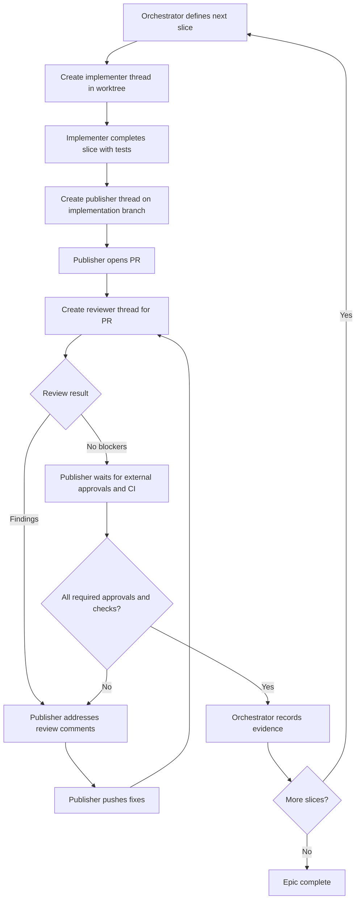

# Codex Epic Thread Orchestration

Use this runbook when an epic or large chunk of work should be implemented as a sequence of smaller, reviewable slices while keeping the main Codex thread clean enough to act as an orchestrator.

The main thread owns sequencing, scope control, and final decisions. Child threads own implementation, PR mechanics, and review. The orchestrator should only start the next slice after the current slice is approved or explicitly abandoned.

## Roles

| Role | Thread type | Owns | Must not own |
| --- | --- | --- | --- |
| Orchestrator | Main thread | Scope, slice order, thread creation, status ledger, go/no-go decisions | Writing most implementation code |
| Implementer | New worktree thread | One bounded slice of code and tests | Opening the PR or responding to later review comments |
| Publisher | Separate thread on the implementation branch | Branch hygiene, commit shaping, PR body, CI, review-comment fix loop | Expanding scope beyond review feedback |
| Reviewer | Separate read-heavy thread | Independent PR review and risk report | Editing the PR branch unless explicitly asked |

Use subagents only for behind-the-scenes read-heavy work inside a thread. Use new Codex threads when the work needs user-visible continuity, separate git state, a PR branch, or a durable review loop.

## Orchestrator Preconditions

Before creating child threads:

1. Confirm the current repository, branch, and worktree state.
2. Run `git status --short --branch`.
3. If the root checkout is dirty, classify every dirty path as:
   - `preserve`: active implementation WIP that should keep moving.
   - `hold`: prototype or ambiguous work that should survive but not enter this lane.
   - `remove`: generated or runtime noise that is safe to recreate.
4. Read current scope docs, issue descriptions, ADRs, and project status files.
5. Split the epic into independently mergeable slices.
6. Write or update a local status ledger before spawning threads.

Suggested status ledger path:

```text
docs/operations/<epic-slug>-thread-ledger.md
```

Ledger fields:

```markdown
# <Epic> Thread Ledger

| Slice | Status | Implementer Thread | Publisher Thread | Reviewer Thread | PR | Current Owner | Next Gate |
| --- | --- | --- | --- | --- | --- | --- | --- |
| 1. <slice name> | planned | | | | | orchestrator | implementation thread |

## Global Scope

## Slice Contracts

## Decisions

## Validation Evidence

## Review Loop Notes
```

## Slice Contract

Each implementation slice must have a small contract before a child thread starts.

```markdown
## Slice <n>: <name>

Goal:

Non-goals:

Files or areas likely involved:

Acceptance criteria:
-

Required validation:
-

Known risks:
-

Merge dependency:

Stop conditions:
- Scope requires a new product decision.
- The slice cannot pass its required validation.
- The PR review finds a blocker that changes the slice contract.
```

## State Machine



## Thread Creation Pattern

1. Orchestrator creates one implementer thread for the next slice, preferably in a new Codex worktree.
2. Orchestrator waits for the implementer to finish, then reads the child thread summary and branch status.
3. Orchestrator creates a publisher thread for the branch.
4. Publisher creates a PR and returns the PR URL, branch, head SHA, and validation proof.
5. Orchestrator creates a reviewer thread for the PR.
6. Reviewer posts a review report back to the orchestrator or directly to the PR, depending on the prompt.
7. Publisher loops on PR feedback until:
   - required CI checks pass,
   - all required approvals are present,
   - all blocking review threads are resolved,
   - no requested-changes reviews remain unresolved.
8. Orchestrator records completion and starts the next slice.

## Codex App Tool Pattern

When the orchestrator is running inside the Codex app, use the app's thread tools deliberately:

1. Use `list_projects` once to find the repo project id.
2. Use `create_thread` for user-visible child threads:
   - implementer: project target, `worktree` environment, base branch or working-tree start as appropriate.
   - publisher: project target, worktree or handoff target associated with the implementation branch.
   - reviewer: project target, worktree or local read-heavy context with the PR URL.
3. Use `set_thread_title` immediately after creating each child thread.
4. Use `read_thread` to collect child status and summaries back into the orchestrator ledger.
5. Use `handoff_thread` only when the publisher must take over an existing branch/worktree safely.
6. Use `fork_thread` only when the child should inherit completed context from the current thread.

Do not create implementation threads for every slice at once. Keep the queue explicit: one active implementation slice, one publisher loop, and one reviewer thread for the current PR unless the user intentionally opts into more concurrency.

## Orchestrator Prompt Template

Use this in the main thread when starting an epic.

```text
Act as the orchestrator for this epic. Do not implement the epic directly unless a small docs or ledger update is needed.

Repo: <absolute repo path>
Epic: <epic name or issue links>
Base branch: <base branch>
Scope docs/issues:
- <doc or issue>

Operating rules:
- Keep a local thread ledger at <ledger path>.
- Before spawning implementation work, run git status and classify dirty paths into preserve / hold / remove.
- Split the epic into independently mergeable slices.
- For each slice, create exactly one implementer thread in a fresh worktree unless the user explicitly chooses same-directory work.
- After implementation finishes, create a separate publisher thread to shape commits, push, and open the PR.
- After the PR exists, create a separate reviewer thread to review the PR.
- The publisher thread owns the review-comment loop until CI is green and all required approvals are present.
- Start the next slice only after the current slice is approved or explicitly abandoned.
- Keep live provider, production, or destructive actions behind explicit approval.
- Preserve unrelated WIP.

First actions:
1. Read the relevant docs/issues.
2. Inspect git status.
3. Propose the slice list and ledger.
4. Start slice 1 only after the slice contract is clear.
```

## Implementer Thread Prompt Template

Create this as a worktree thread from the orchestrator.

```text
You are the implementer for one bounded slice of a larger epic. Implement only this slice.

Repo: <absolute repo path>
Base branch: <base branch or current working tree state>
Slice: <slice n and name>
Ledger: <ledger path>
Relevant docs/issues:
- <doc or issue>

Slice contract:
<paste the slice contract>

Rules:
- Work in this thread's worktree.
- Run the repo's worktree bootstrap first if available: pnpm worktree:bootstrap.
- If commands need root env/tooling, use the repo wrapper when available: node scripts/with-root-env.mjs <command>.
- Keep edits scoped to the slice contract.
- Do not open a PR.
- Do not broaden the slice to adjacent features.
- Preserve unrelated WIP.
- Commit only if the orchestrator asks; otherwise leave a clean, reviewable diff and report exact files changed.

Required output:
- Summary of behavior changed.
- Tests and validation run, with pass/fail results.
- Files changed.
- Branch/worktree state.
- Risks or follow-up questions.
- Whether this is ready for the publisher thread.
```

## Publisher Thread Prompt Template

Create this as a separate thread after the implementer finishes. It should run on the implementation branch or be handed to that branch/worktree before publishing.

```text
You are the publisher for this slice. Your job is to turn the completed implementation diff into a reviewable PR, then own the review-comment loop until approval.

Repo: <absolute repo path>
Slice: <slice n and name>
Implementation thread: <thread id or link>
Ledger: <ledger path>
Base branch: <base branch>
Target PR branch: <branch name>

Inputs:
- Implementation summary:
  <paste summary>
- Validation evidence:
  <paste validation>
- Slice contract:
  <paste contract>

Publish rules:
- Inspect git status before staging.
- Stage only files that belong to this slice.
- Preserve unrelated WIP.
- Create a clear commit message referencing the slice or issue.
- Push the branch.
- Open a draft PR unless the orchestrator explicitly asks for ready-for-review.
- PR body must include scope, validation, risks, and links to the ledger or issues.
- Return PR URL, branch, head SHA, checks status, and any known blockers.

Review-loop rules:
- After the PR is open, watch CI, PR comments, review submissions, and unresolved inline threads.
- Address only actionable review feedback and failing checks.
- If feedback changes product scope, pause and ask the orchestrator.
- Push fixes to the same PR branch.
- Continue until required CI is green, all required approvals are present, and blocking review threads are resolved.
- Report every loop iteration back to the orchestrator with what changed and what remains.
```

## Reviewer Thread Prompt Template

Create this as a separate read-heavy thread after the PR exists.

```text
You are the independent reviewer for this PR. Review like an owner. Prioritize correctness, behavioral regressions, security/privacy risks, missing tests, and maintainability.

Repo: <absolute repo path>
PR: <PR URL or number>
Base branch: <base branch>
Slice contract:
<paste contract>

Review rules:
- Treat the slice contract as the review boundary.
- Do not implement fixes.
- Read the PR diff, relevant surrounding code, and tests.
- Check that validation matches the risk of the change.
- Report findings first, ordered by severity, with file and line references where possible.
- Call out missing tests or residual risk.
- If no issues are found, say that clearly.
- Do not request broad refactors unrelated to this slice.

Required output:
- Blocking findings.
- Non-blocking findings.
- Test gaps.
- Approval recommendation: approve, approve after nits, or request changes.
```

## Approval Authority

The reviewer thread provides an independent review signal. It does not count as a required approval unless it actually submits an approving GitHub review and the orchestrator has named it as an approval source.

The publisher thread must not self-approve. It can verify that approvals exist, but approval comes from the required human, team, GitHub rule, or explicitly designated review agent.

## Publisher Approval Loop

The publisher thread stays active after the PR opens.

Loop steps:

1. Fetch current PR status:
   - PR state and mergeability.
   - CI/check runs.
   - Review submissions.
   - Unresolved review threads.
   - Top-level comments since last loop.
2. Classify feedback:
   - `must-fix`: requested changes, failing checks, correctness bugs, security risks, missing required tests.
   - `should-fix`: low-risk comments that improve clarity or maintainability inside scope.
   - `orchestrator-decision`: product changes, scope expansion, tradeoffs, destructive actions.
   - `wont-fix`: out of scope or superseded feedback, with rationale.
3. Implement `must-fix` and approved `should-fix` items.
4. Run targeted validation.
5. Commit and push.
6. Reply to review comments with concise resolution notes.
7. Repeat until the approval gate is satisfied.

Approval gate:

```text
The slice is approved only when:
- PR is open and targets the intended base branch.
- Required checks pass on the latest head SHA.
- Required approvals are present on the latest head SHA.
- No unresolved requested-changes review remains.
- No blocking inline review thread remains unresolved.
- The publisher has reported the final head SHA and validation evidence.
```

## Orchestrator Between-Slice Gate

Before starting the next slice, the orchestrator must update the ledger with:

- PR URL.
- Final head SHA.
- CI status.
- Approval status.
- Validation commands and results.
- Any deferred follow-up.
- Any scope changes made during review.

Then decide:

```text
If the slice merged or is approved and waiting for an external merge, start the next independent slice.
If the slice is blocked by a product decision, stop and ask the user.
If the slice reveals prerequisite work, create a new slice contract and reorder the queue.
If the slice is abandoned, record why before moving on.
```

## Review Comment Escalation Rules

Escalate to the orchestrator instead of fixing immediately when review feedback:

- Changes the slice's user-visible behavior beyond the accepted contract.
- Requires a migration, destructive command, production action, or live provider effect.
- Conflicts with another reviewer comment.
- Would touch unrelated modules to satisfy a style preference.
- Indicates the slice contract was wrong or incomplete.

The orchestrator should decide whether to amend the current slice, create a follow-up slice, or reject the feedback with rationale.

## Branch And Worktree Naming

Recommended branch names:

```text
codex/<epic-slug>-slice-<n>-<short-name>
```

Recommended thread titles:

```text
<Epic> S<n> Implement <short name>
<Epic> S<n> Publish PR
<Epic> S<n> Review PR
```

Avoid reusing the same branch in multiple checked-out worktrees at the same time. If the publisher needs to take over the implementer's branch, hand off the implementation thread or create the publisher thread against the existing worktree/branch.

## Failure Modes

| Symptom | Likely cause | Recovery |
| --- | --- | --- |
| Orchestrator context gets noisy | Main thread is doing implementation or log triage | Move implementation, CI debugging, and review loops back to child threads |
| PR contains unrelated files | Publisher staged the dirty root or mixed WIP | Reset the PR branch only after preserving WIP, then stage explicit paths |
| Implementer cannot run tests in worktree | Worktree dependencies or env wrappers are missing | Run `pnpm worktree:bootstrap`; use `node scripts/with-root-env.mjs` when needed |
| Reviewer starts redesigning the epic | Review prompt lacks slice contract | Re-run review with the slice contract and ask for only blocking findings |
| Review loop never ends | Publisher is treating all comments as must-fix | Classify feedback and escalate scope decisions to the orchestrator |
| Next slice starts too early | Orchestrator skipped approval gate | Stop new work, update ledger, and finish or abandon the current slice explicitly |

## Minimal Run Checklist

```markdown
- [ ] Orchestrator inspected repo state and dirty tree.
- [ ] Epic split into mergeable slice contracts.
- [ ] Ledger created or updated.
- [ ] Slice implementer thread created in worktree.
- [ ] Implementer reported validation and ready-for-publish state.
- [ ] Publisher thread created on implementation branch/worktree.
- [ ] Publisher opened PR and reported PR URL/head SHA.
- [ ] Reviewer thread reviewed PR against slice contract.
- [ ] Publisher resolved review comments and CI failures.
- [ ] Required approvals and checks are green.
- [ ] Orchestrator recorded final evidence.
- [ ] Orchestrator started next slice or closed the epic.
```
